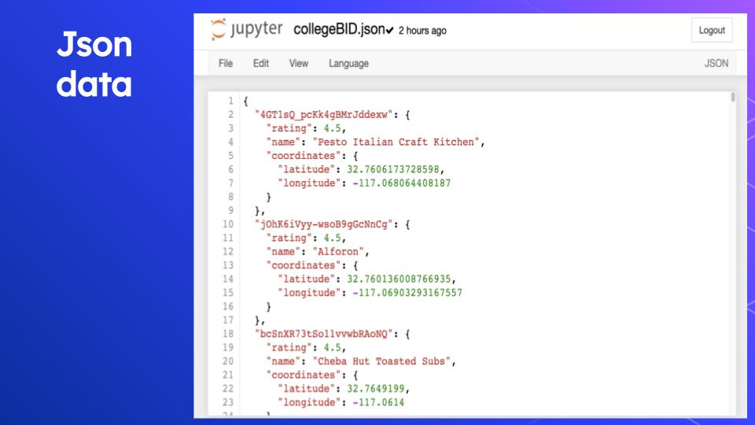
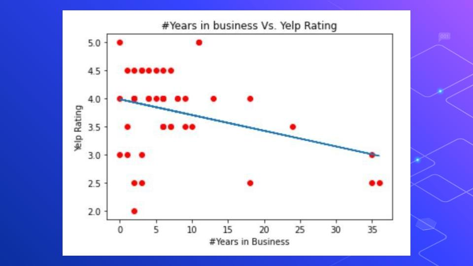

# San Diego Business Analysis

### Introduction

In the 6 months data analysis internship, our group worked on a variety of sources to analyze San Diego businesses performance. My specific role in the group is to scale our data analysis with the Yelp API to gain more data. Yelp API is a powerful tool that allowed us to gain insights and descriptive statistics on our interested businesses. My work can be found in the yelp folder, and this markdown file serves as a summary of my work.

### Data Acquisition

In this section, I included a segment of my HTTP requests from the Yelp API, analytical data I received on businesses, location data I plotted on Folium, and text review data from the Yelp API.

### Data Analysis

More Data Analysis processes can be found in yelp-analysis.ipynb, and here are some summary of our results. I used nltk libraries for data cleaning, and the scikit learn libraries for classification. I manually implemented the bag of words method as well as finding the most explanatory words by sorting the weight of each word. Our model has an approximately 75% accuracy in correctly determining the sentiment of a review.

### Data Integration

Towards the end of our project, data integration became very important because our members wanted to integrate results. I conducted a few fuzzy match on business names and addresses to connect the data I received from the yelp API to the city open sets. This way, we gain more insights and descriptive statistics of our data.

